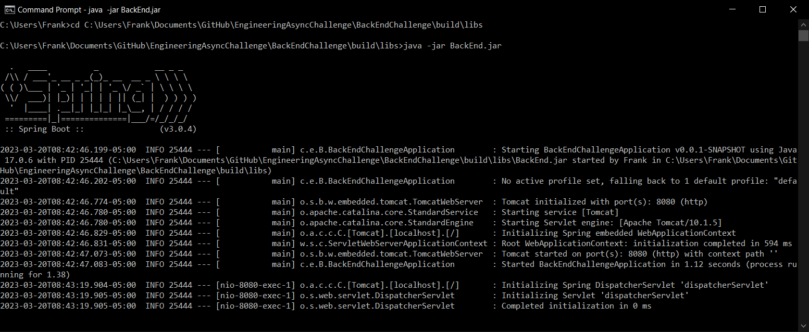
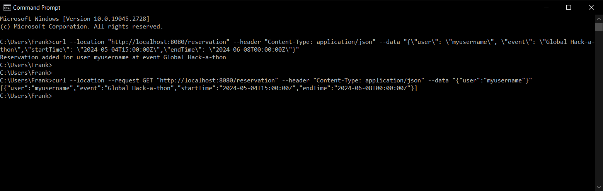

#Back End Challenge\
-POST endpoint at /reservation, takes in JSON to add an event reservation (complete)\
-Event reservation must not have already passed (complete)\
-Event must not overlap with existing reservation (complete)\

-GET endpoint at /reservation, gets all future event reservations (complete)\
    -Returns in JSON format\
-All endpoints return standard http response status codes (complete)\
-Error responses include supporting error message (uncompleted)\
    -Assumes JSON keys are correct, but values themselves may be incorrect\
    -Get endpoint will return http response 404 (not found), but missing error response when user does not exist
    

