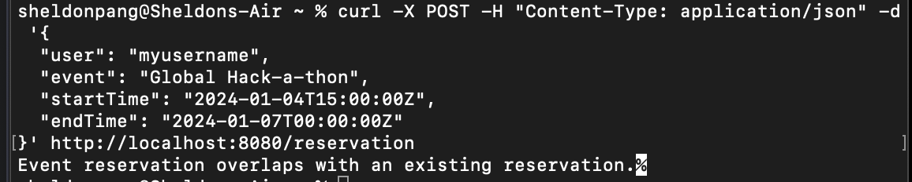

# Event Reservation API
This project is a simple RESTful API for managing event reservations built using the Spring Boot framework. Users can create event reservations and fetch all future reservations.

## Table of Contents

- [Requirements](#Requirements)  
- [Installation](#Installation)
- [Screenshots Demo](#Screenshots-Demo)
- [Usage](#Usage)
- [API Endpoints](#API-Endpoints)
    - [Create an event reservation](#Create-an-event-reservation)
    - [Get all future event reservations](#Get-all-future-event-reservations)
- [Testing](#Testing)
- [License](#License)
## Requirements

- JDK 11 or later
- Maven

## Screenshots Demo

## Installation

Run the main class "BackEndChallengeApplication" in project to start the application.

The API is now running on http://localhost:8080.

## Usage

You can use any REST client, such as Postman or cURL, to interact with the API. 

cURL example:

    curl -X POST -H "Content-Type: application/json" -d '{
    "user": "myusername",
    "event": "Global Hack-a-thon",
    "startTime": "2022-01-04T15:00:00Z",
    "endTime": "2022-01-07T00:00:00Z"
    }' http://localhost:8080/reservation

Alternatively, you can use a browser for GET requests.
      
    http://localhost:8080/reservation?user=myusername

## API Endpoints

### Create an event reservation
- URL: /reservation
- Method: POST
- Content-Type: application/json
- Payload:

        {
        
        "user": "myusername",
        
        "event": "Global Hack-a-thon",
        
        "startTime": "2023-01-04T15:00:00Z",
        
        '"endTime": "2023-01-07T00:00:00Z"
        
        }

Success Response:

- Code: 201 CREATED
- Content: Event reservation created.

Error Responses:

- Code: 400 BAD REQUEST
- Content: Event start time has already passed.
- Code: 409 CONFLICT
- Content: Event reservation overlaps with an existing reservation.

### Get all future event reservations
- URL: /reservation
- Method: GET
- URL Params: user=myusername
- Success Response:
- Code: 200 OK
- Content:
        
        [
            {
                "user": "myusername",

                "event": "Global Hack-a-thon",
                
                "startTime": "2023-01-04T15:00:00Z",
                
                "endTime": "2023-01-07T00:00:00Z"
            }
        ]

## Testing

You can test the API endpoints using Postman, cURL, or other REST clients. You can also create integration tests using Spring Boot Test and JUnit.

## License

This project is released under the MIT License.