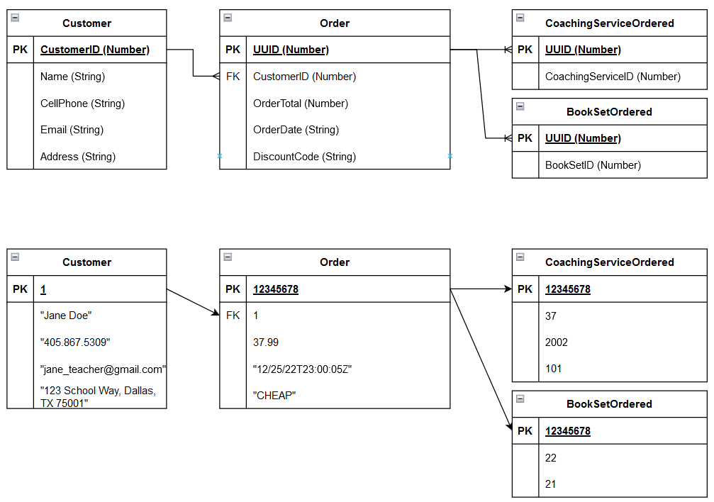
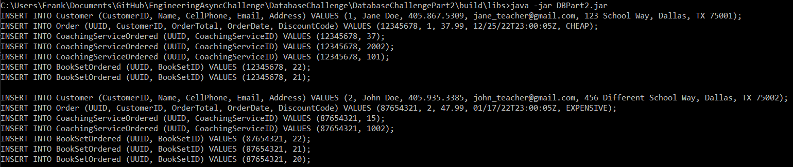

#Database Challenge Requirements\
Part1:\
-Submit new relational data model visualization as a proposed design

Part2:\
-Create Java program to migrate records from old database to new database\
-Read in JSON\
-Format to new data model\
-Print sql statements to insert those records into new database\

