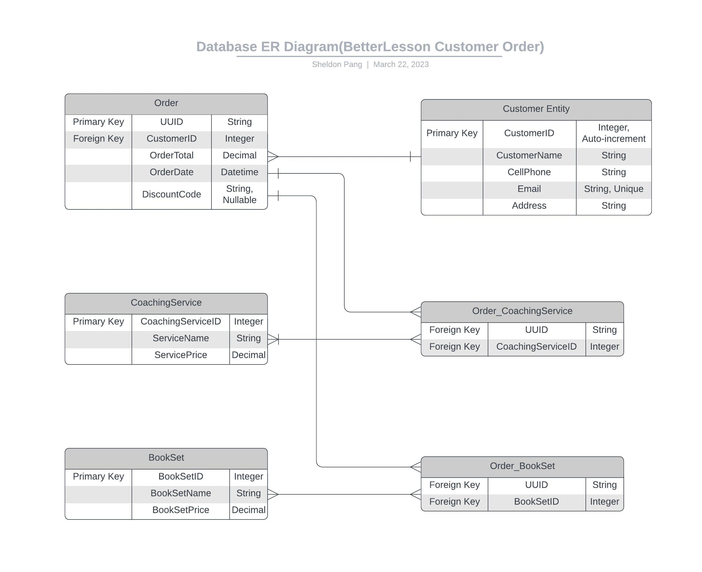
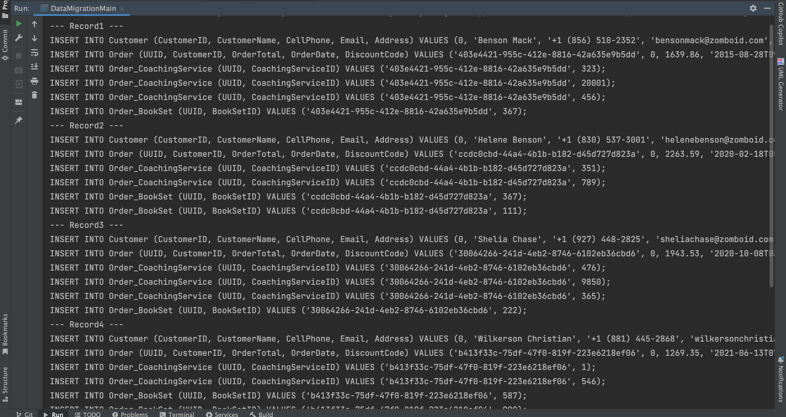

# Order Data Migration Java Application

This Java application processes JSON data from a NoSQL database and outputs SQL statements for inserting the data into a new relational database schema. The application reads the JSON file, formats the data to match the new data model, and prints the SQL statements to the console.

## Table of Contents

- [Requirements](#Requirements)  
- [Screenshots Demo](#Screenshots-Demo)
- [Installation](#Installation)
- [License](#License)

## Requirements

- Java Development Kit (JDK) 8 or later
- An IDE such as Eclipse or IntelliJ IDEA

## ER Diagram

## Screenshots Demo

## Installation

1. Import the project into your IDE.

2. Add the org.json library to your project's dependencies:
    
    
- For IntelliJ IDEA:

  - You can add the JAR file to your project's classpath by open the "Project Structure", selecting "Open Module Settings", and navigating to the "Modules" and "Dependencies" (IntelliJ) settings. Click the "+" icon and "JARs or directories" to add the JAR file.

3. Run the main in DataMigrationMain.java file

    You should now see the SQL statement in console output.

## License

This project is released under the MIT License.