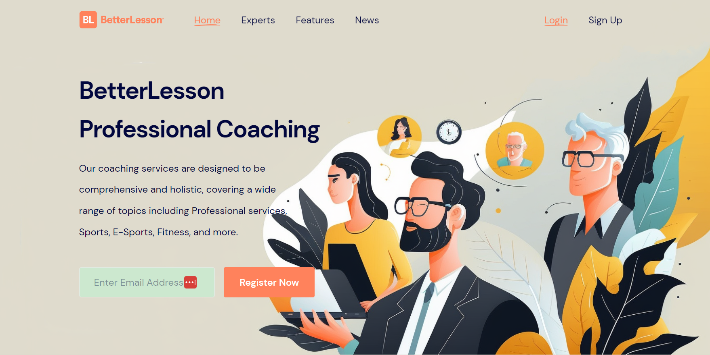
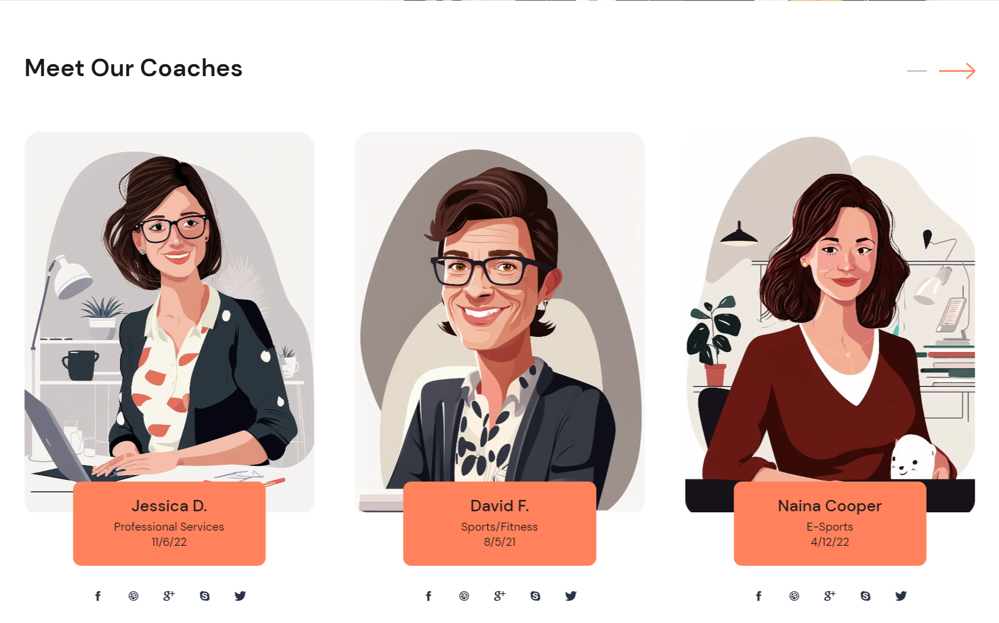
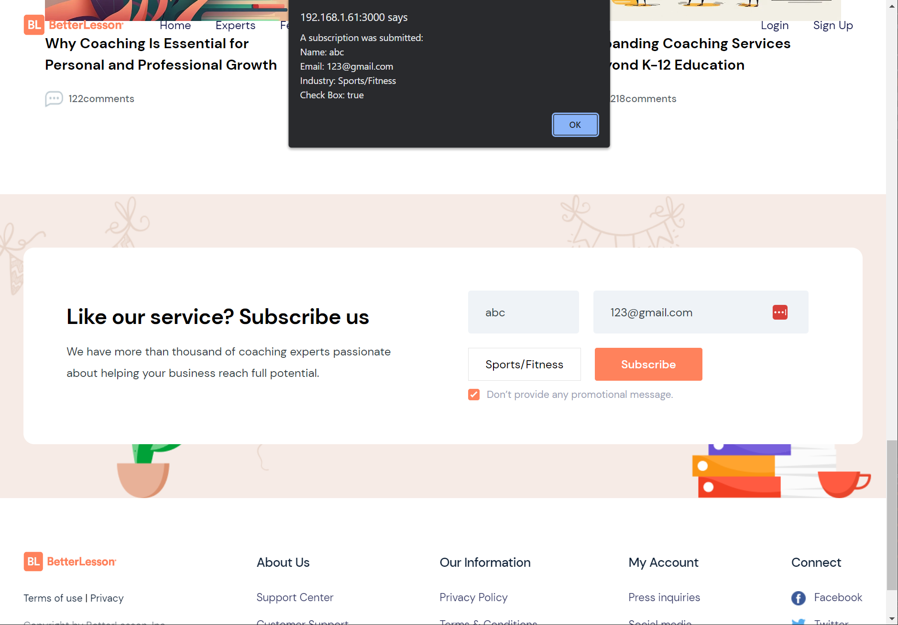

## Installation

After downloading the file, install using

    yarn

starting NextJs Server run

    yarn next-dev

NextJs Server should start in

localhost:3000

## Live Demo

[https://better-lesson-react-landing-page-landing.vercel.app/](https://better-lesson-react-landing-page-landing.vercel.app/)

## Screenshots Demo

## License

This project is released under the MIT License.