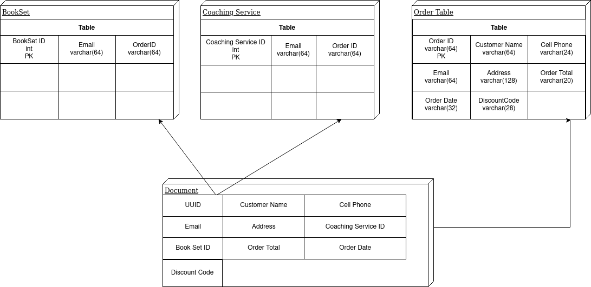

# Data-Base Challenge

<h3> This premise of migrating the unstructured data to a relational table structure takes into account that each document is an order with corresponding
bookSet and Coaching Services. Breaking the data into 3 tables allows us to use joins to analyze which booksets and coaching services belong to what order and customer.</h3>

<h4> To run on your machine:</h4>

<h4 style="display: inline-block"> * Clone repo and navigate to /data-base-challenge directory </h4>
<h4> * Use python ./main.py. </h4>